# Introduction

## Population variation

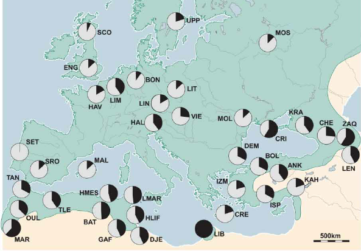{fig-align="center" height="550" fig-alt="Illustration of relative bill length across dozens of populations of chaffinch in Europe and North Africa."}


:::{.source}
[Perktaş 2011. Ecogeographical variation of body size in Chaffinches _Fringilla coelebs_. _Bird Study_. 58:264-277.](https://doi.org/10.1080/00063657.2011.587868)
:::

## Dog populations

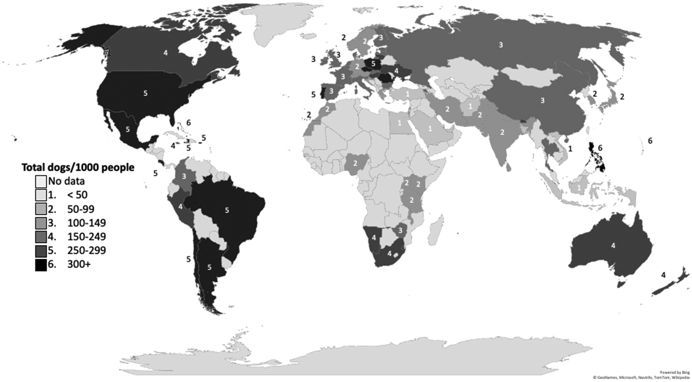{fig-align="center" height="550" fig-alt="Illustration of distribution of dog densities across countries on a world map."}

:::{.source}
[Brice 2021. Dogs as pets and pests: Global patterns of canine abundance, activity, & health.  _Integrative & Comparative Biology_, 61:154–165.](https://doi.org/10.1093/icb/icab046)
:::


## Research question

::: {.callout-tip appearance="simple"}
::: {style="font-size: 40px"}
How generalizable are results from one sample of dogs?
:::
:::

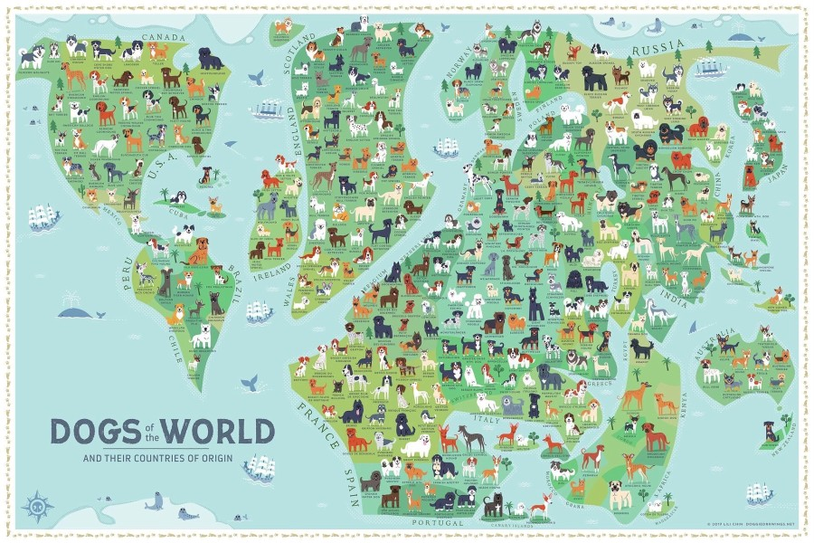{fig-align="center" height=500}


:::{.source}
Artwork by [Lili Chen](https://doggiedrawings.net/)
:::

<!-- ## Dogs and humans -->

<!-- 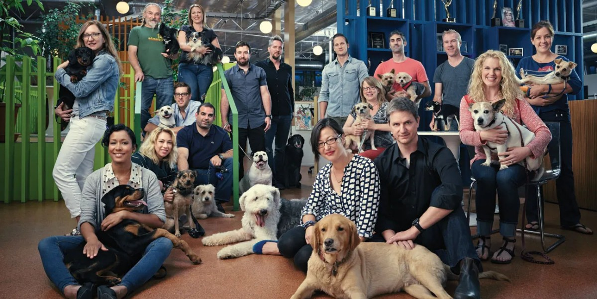{fig-align="center" height="550"} -->

<!-- :::{.source} -->
<!-- Source: [Hollywood Reporter](https://www.hollywoodreporter.com/video/inside-hollywoods-pet-friendly-offices-722375/) -->
<!-- ::: -->

# Replication across populations

## What dogs see

{fig-align="center" fig-alt="Illustration of dog color spectrum compared to human color spectrum."}

:::{.source}
Illustration by <a href="https://petsittingmalta.com/dog-vision-explained/">Pet Sitting Malta</a>
:::


## What do dogs prefer?

::: {.r-stack}
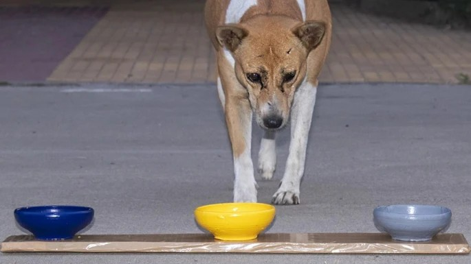{fig-alt="Brown and white street dog approaching wooden tray with blue, yellow, and grey bowls."}

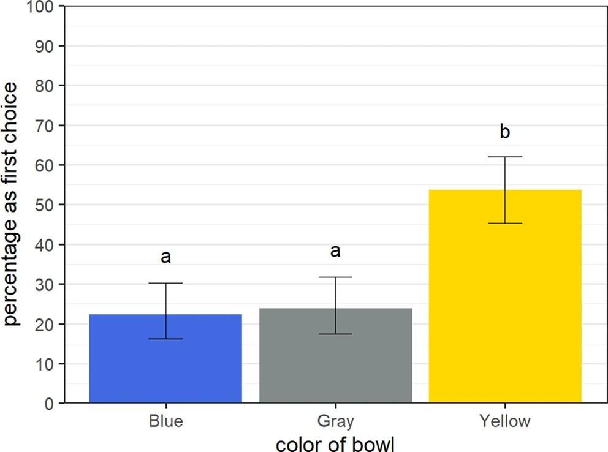{.fragment height=550 fig-alt="Dynamite plot of percentage of each color bowl (blue, grey, and yellow) as first choice. Twice as many dogs chose yellow compared to blue or grey."}
:::

::: {.source}
[Roy et al. 2025](https://doi.org/10.1007/s10071-024-01928-9)
:::


## Why am I worried about dog color preferences?

:::{.fragment}
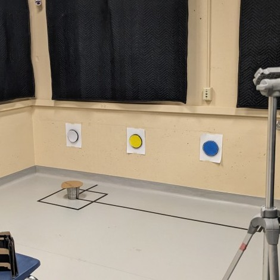{.absolute top=200 left=100 height="350" fig-alt="Image of multi-colored dog toys on carpet or grass for both human and dog color vision."}

{.absolute top=200 left=600 height="350" fig-alt="Image of person pointing to one of two blue cups."}
:::

:::{.source}
Images by [pawleaks.com](https://pawleaks.com/are-dogs-color-blind-and-what-colors-can-they-see/) and UNL CCHIL
:::


## Replicate Roy et al. 2025

::: {.callout-tip appearance="simple"}
## Research Question

::: {style="font-size: 40px"}
Do pet dogs in the U.S. prefer the color yellow?
:::
:::

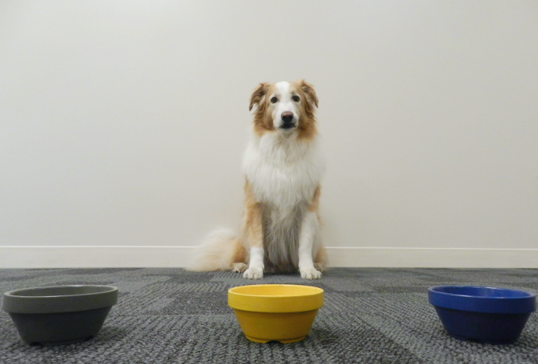{fig-align="center" fig-alt="Brown and white dog sitting behind grey, yellow, and blue bowls."}


## Experiment 1 methods

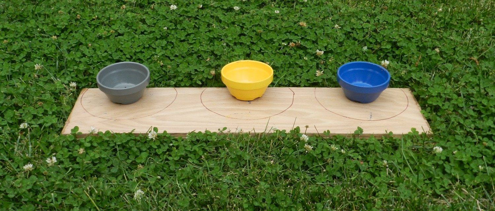{fig-align="center" fig-alt="Brown and white dog sitting behind grey, yellow, and blue bowls."}

* Tested 75 dogs at dog parks, dog bars, etc.
* Chose between grey, yellow, and blue bowls
* Recorded first bowl approached

## No color preference

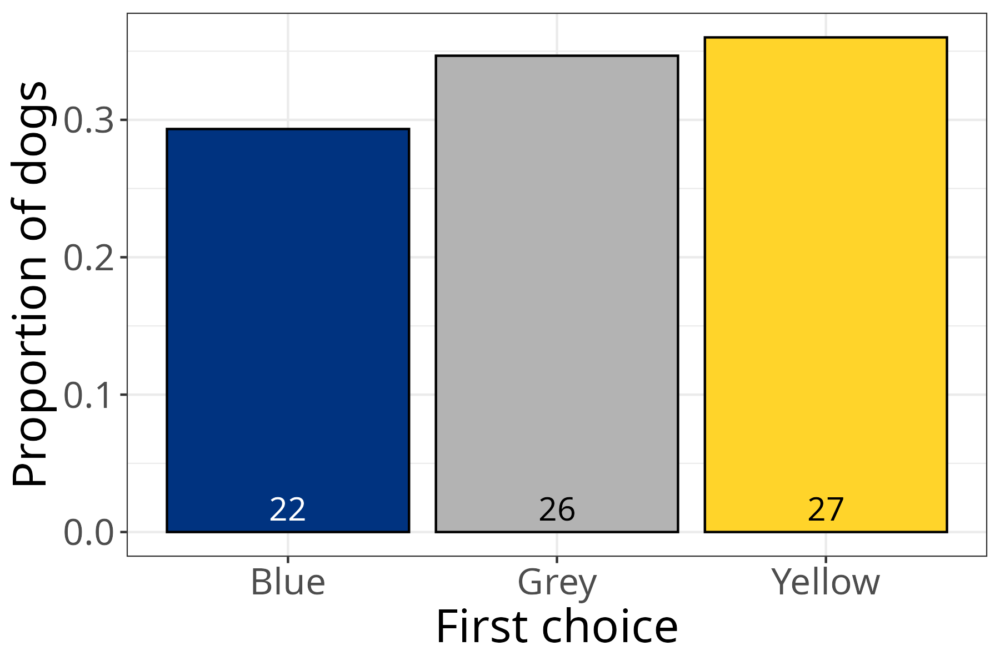{fig-align="center"  fig-alt="Plot of number of subjects for each bowl color showing stronger preference for yellow over blue."}

## Experiment 2 methods

{fig-align="center" fig-alt="Brown and white dog sitting behind grey, yellow, and blue bowls."}

* Tested 134 dogs under 7 years old at dog parks 
* Chose between grey, yellow, and blue bowls
* Recorded first bowl approached 
<!-- * Some trials with no food -->


## Dogs preferred yellow

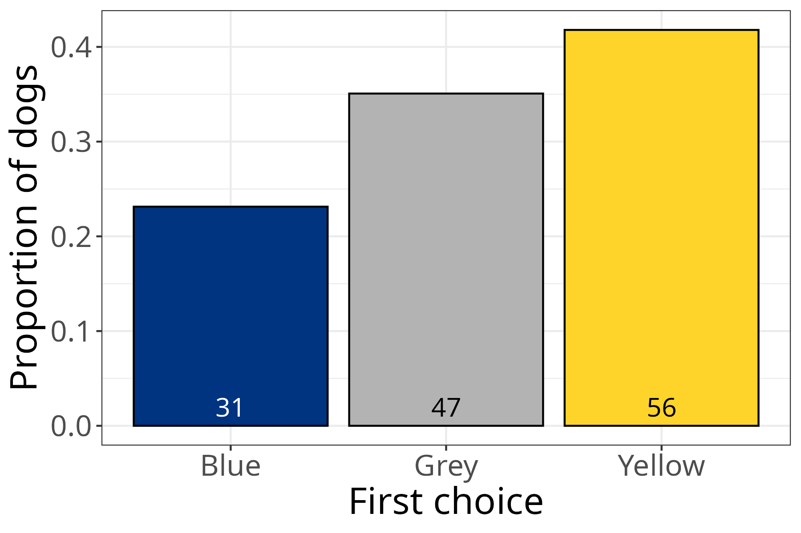{fig-align="center"  fig-alt="Plot of number of subjects for each bowl color showing stronger preference for yellow over blue."}

<!-- {.absolute top=120 left=550 height=500 fig-alt="Brown and white dog sitting with nose in yellow bowl."} -->


<!-- ## No effect of food present/absent -->

<!-- 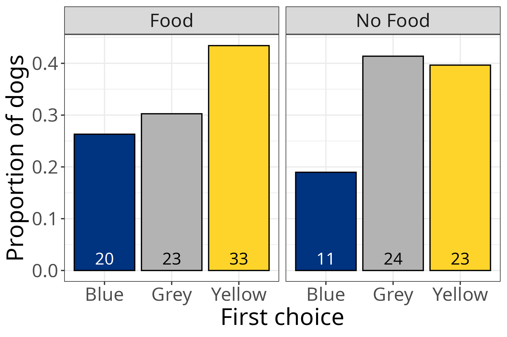{fig-align="center" fig-alt="Plot of number of subjects choosing blue, grey, and yellow bowls with separate panels for with and without food."} -->

## No effect of position

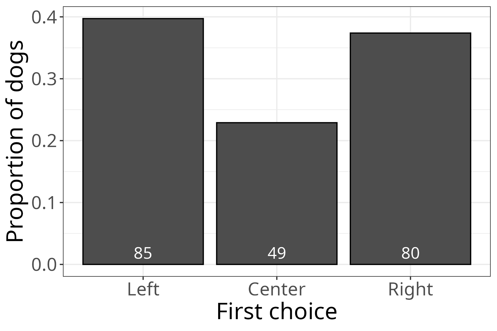{fig-align="center" fig-alt="Plot of number of subjects chooseing blue, grey, and yellow bowls with separate panels for purebred and mixed breed dogs."}


## No effect of sex

{fig-align="center" fig-alt="Plot of number of subjects choosing blue, grey, and yellow bowls with separate panels for males and females."}


## No effect of purebreed/mixed breed

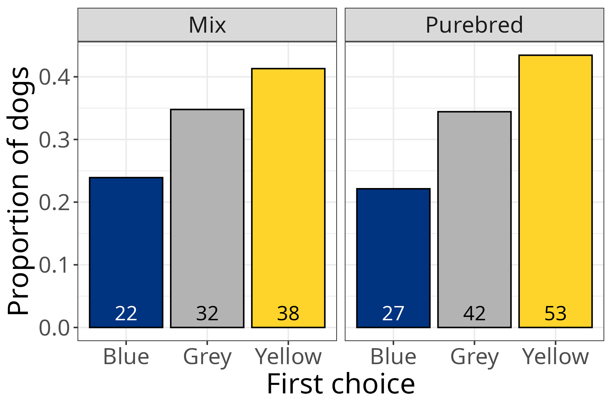{fig-align="center" fig-alt="Plot of number of subjects choosing blue, grey, and yellow bowls with separate panels for purebred and mixed breed dogs."}


## No effect of weather

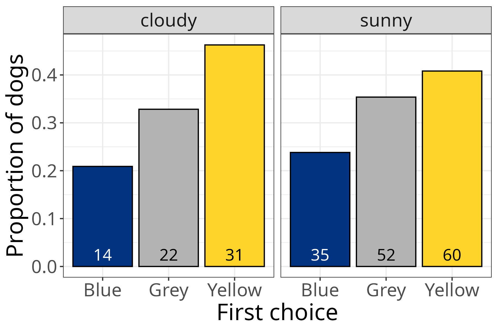{fig-align="center" fig-alt="Plot of number of subjects choosing blue, grey, and yellow bowls with separate panels for cloudy, rainy, and sunny weather."}


## But what else might cause preference?

{fig-align="center" fig-alt="Image of wooden tray with blue, yellow, and grey bowls."}

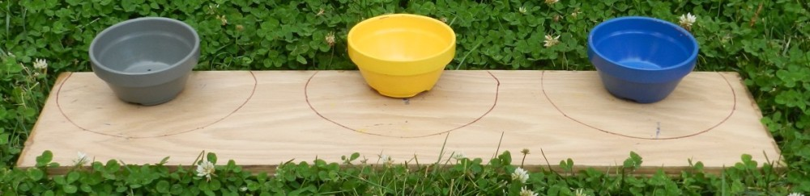{.absolute top=250 left=175 width=700 fig-alt="Image of wooden tray with blue, yellow, and grey bowls."}

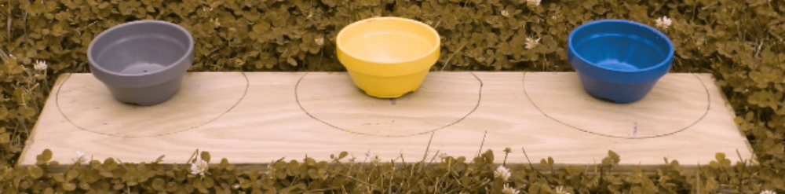{.absolute top=450 left=175 width=700 fig-alt="Image of wooden tray with blue, yellow, and grey bowls using a filter for dog vision."}


## Experiment 2 methods

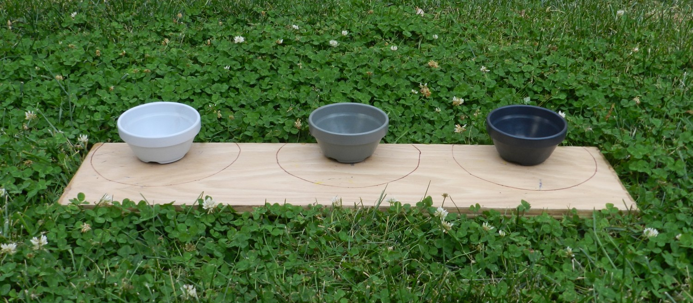{fig-align="center" fig-alt="Illustration of light, medium, and grey bowl."}

* 141 dogs under 7 at dog parks, bars, and daycares
* Chose between light, medium, and dark grey bowls


## Dogs didn't prefer light grey

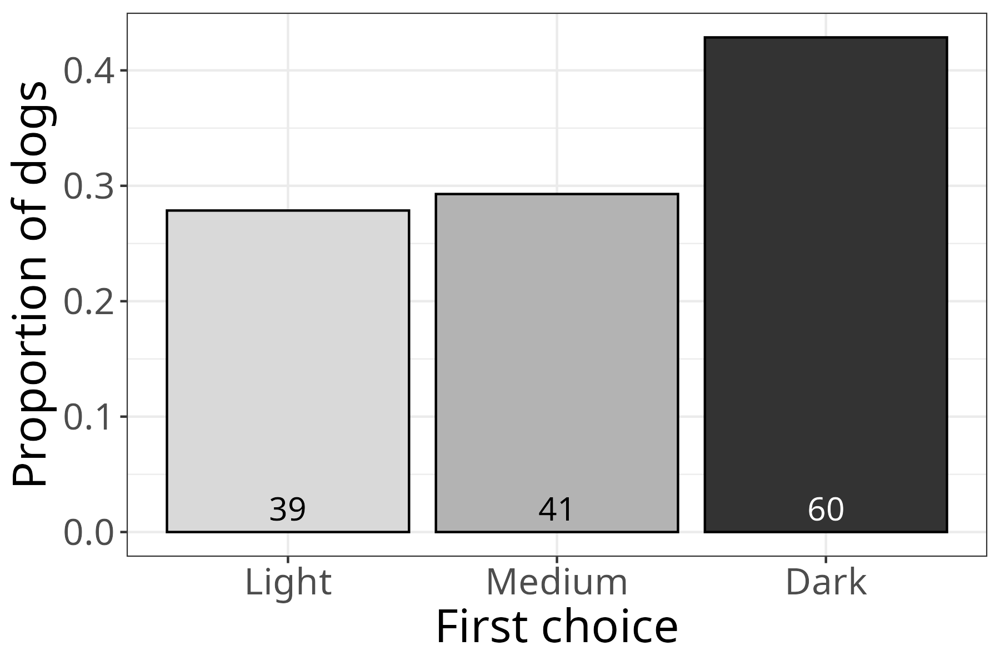{fig-align="center" fig-alt="Plot of number of subjects choosing light, medium, and dark grey bowls showing slight preference for dark bowls."}


## Summary

::::{.columns}
:::{.column}
:::{.incremental}
* We replicated Roy et al. (2025)

* Similar preferences across two (very different) populations of dogs

* Brightness can't account for this preference
:::
:::
:::{.column}
{fig-alt="Brown and white dog playing with yellow dog puzzle." width=350}
:::
::::


# Variation between research sites

## Failed replication

{fig-align="center"}

:::{.source}
[Stevens et al. 2022](https://doi.org/10.26451/abc.09.03.02.2022)
:::


## What is big team science?

<!-- Large-scale collaborations where a large number of researchers across multiple independent research sites pool resources to conduct  the same study across sites. -->

:::{.fragment}
{fig-align="center" width="1000"}
:::


## ManyX projects

* ManyPrimates
* ManyBirds
* ManyGoats
* ManyFishes
* ManyOtters
* ManyPigs
* ManyZoos
* ManyManys


## ManyDogs Project

International research consortium of scientists with shared interest in canine behavior and cognition ([manydogs.org](https://manydogsproject.github.io))

{fig-align="center" height="300" fig-alt="ManyDogs logo with yellow, orange, and blue dogs jumping between the words Many and Dogs."}


## ManyDogs Project

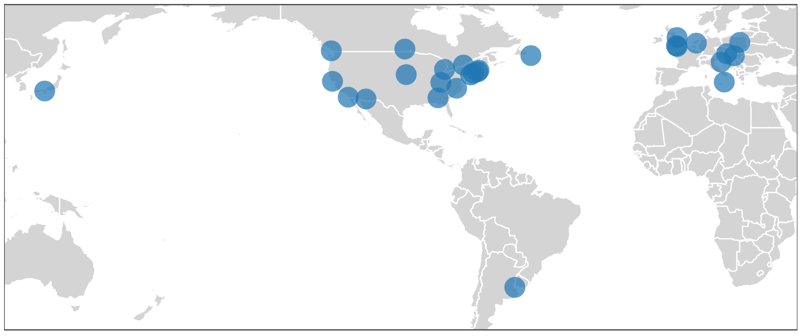{fig-align="center" fig-alt="Map of the world with ManyDogs Project sites marked with blue dots."}

## ManyDogs 1

::: {.callout-tip appearance="simple"}
## Research Question

::: {style="font-size: 40px"}
Do dogs treat human pointing as communicative cues?
:::
:::

{.absolute top=250 left="55%" width="550"}

::: {.fragment}
* 704 dogs tested
* 20 research sites


{.absolute top=250 left="55%" width="600" }
:::

::: {.source}
[ManyDogs Project et al. 2023, _Animal Behavior & Cognition_](https://doi.org/10.26451/abc.10.03.03.2023)
:::

## ManyDogs 1 demographics

:::{.fragment}
### Dog demographics
* Age, sex, neuter status, breed, origin, years in home, previous research experience
:::

:::{.fragment}
### Guardian demographics
* Age, gender
:::

:::{.fragment}
### Household demographics
* Dogs in household, urban/suburban/rural environment
:::

## Continuous demographics across sites

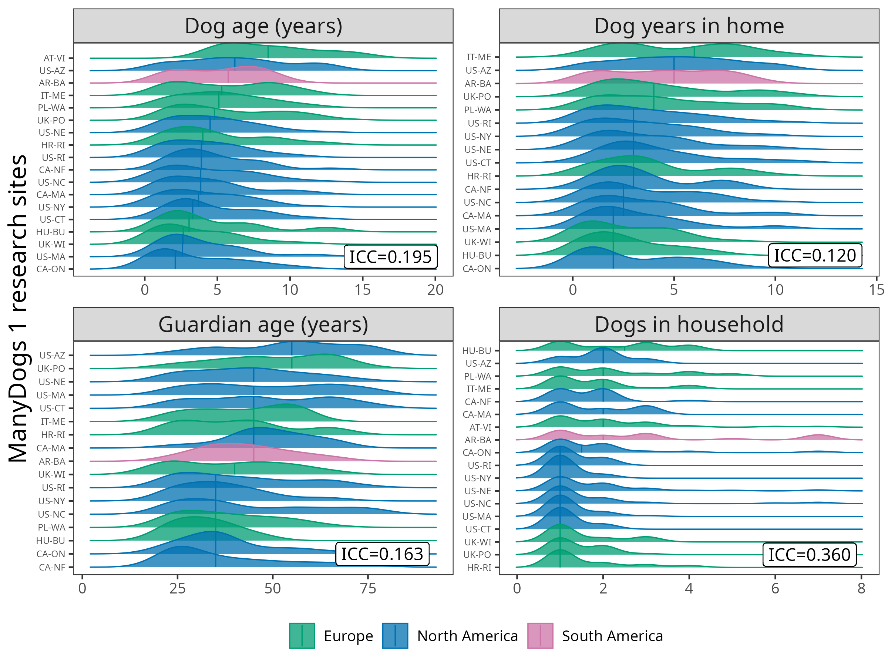{fig-align="center" height="600" .fragment}


## Binary demographics across sites

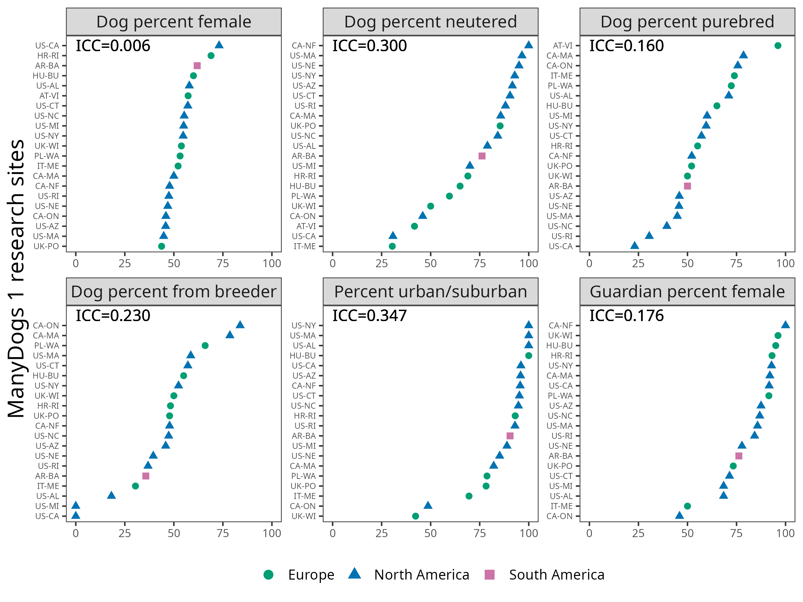{fig-align="center" height="600" .fragment}


## Regional comparisons

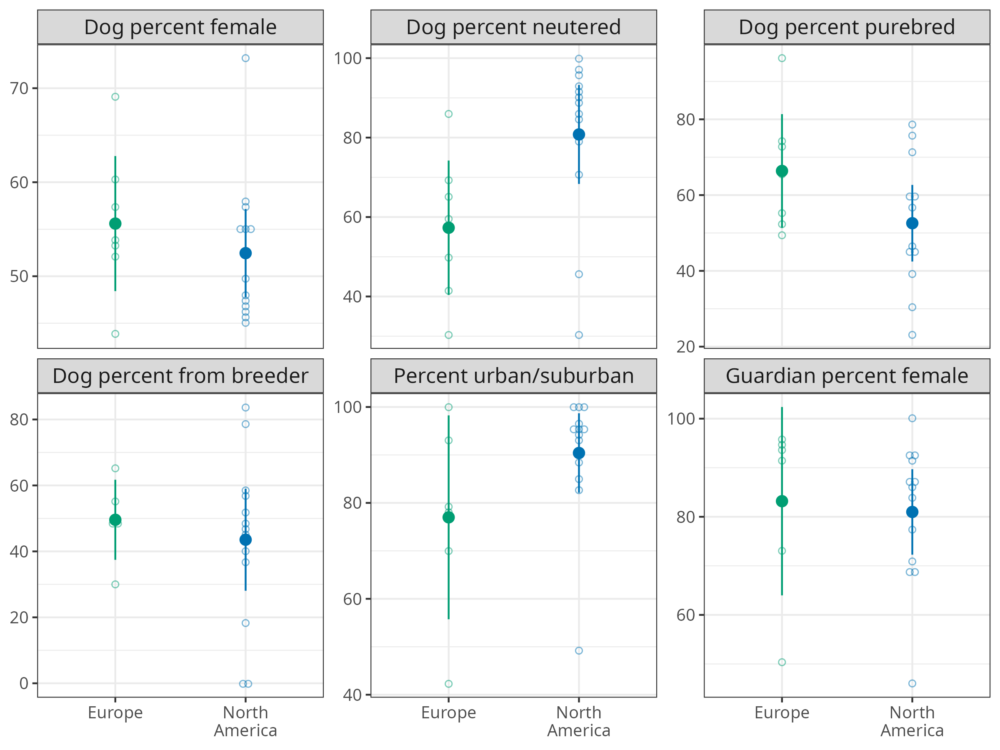{fig-align="center" height="600" .fragment}


<!-- ## Behavioral data across sites -->

<!-- {fig-align="center" height="600" .fragment} -->


<!-- ## Demographic effects on behavior -->

<!-- {fig-align="center" height="600" .fragment} -->


## Demographic questions

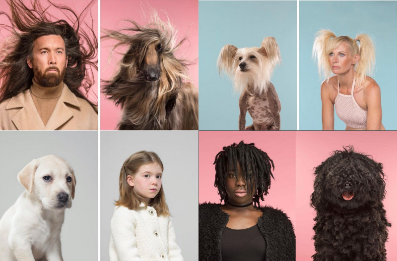{fig-align="center" height="550"}

:::{.source}
Photo by [Gerard Gethings](https://www.gerrardgethings.com/)
:::


## Reported demographics (2019-2024)

{fig-align="center" height="600"}


## Recommended demographics

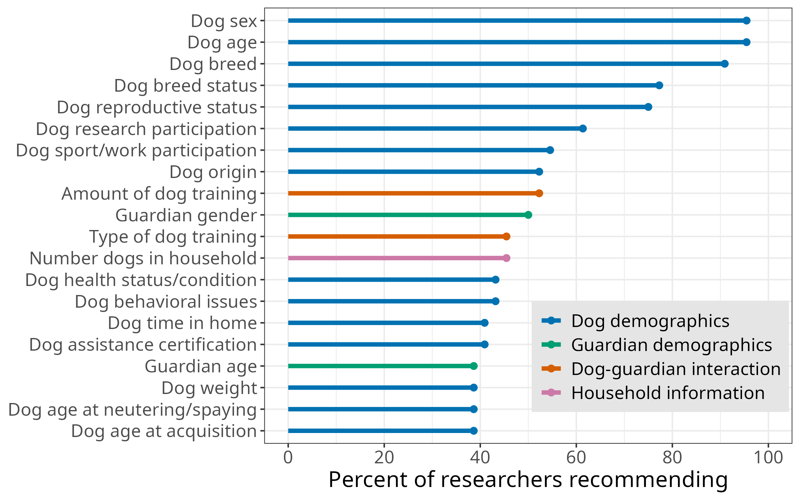{fig-align="center" height="600"}


## Summary

::: {.incremental}
* Multiple levels of variation

* Striking demographic variation across research sites

* Inconsistent reporting of demographics

* Carefully consider sample when comparing studies
:::

# Wrap-up

## Take home message

A dog is not a dog is not a dog

{fig-align="center" height="500"}

:::{.source}
Photo by [Hollywood Reporter](https://www.hollywoodreporter.com/video/inside-hollywoods-pet-friendly-offices-722375/)
:::

## Contact

```{r}
library(icons)
```

 `dogcog.unl.edu`

 `unl_cchil`

 `unl.cchil`

 `@unlcchil.bsky.social`

<!-- :::: {.columns} -->
<!-- ::: {.column width="60%"} -->
<!-- Stevens, J.R., Gatesy-Davis, A., Couture, S., & Worth, Y. (2026). Color preferences in dogs: A replication study. _PsyArXiv._ [doi:10.31234/osf.io/v8phx_v1](https://doi.org/10.31234/osf.io/v8phx_v1). -->
<!-- ::: -->
<!-- :::: -->

{.absolute top="15%" left="60%" height="550" fig-alt="Image of light brown dog with yellow tennis ball in its mouth."}

:::{.source}
Photo by <a href="https://unsplash.com/@ethanrichardson?utm_source=unsplash&utm_medium=referral&utm_content=creditCopyText">Ethan Richardson</a> on <a href="https://unsplash.com/photos/white-and-brown-long-coated-dog-playing-tennis-ball-sZqAaxhXNtU">Unsplash</a>
:::
